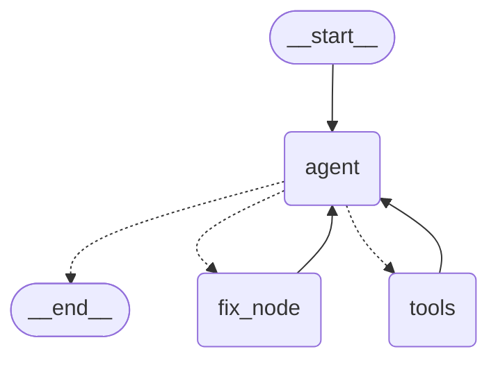
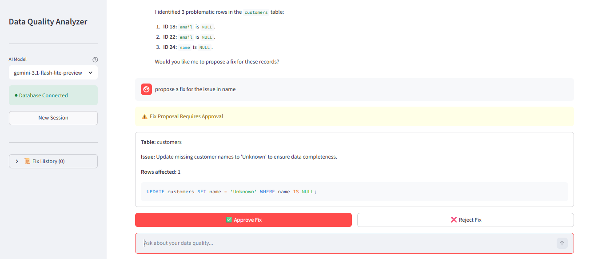

# DQ-Analyzer: AI-Powered Data Quality Agent

**DQ-Analyzer** is a PostgreSQL-focused data quality exploration tool with a Streamlit UI, rule-based profiling workflows, deterministic Great Expectations checks, and a Gemini-backed agent that can investigate issues, propose SQL fixes, and require human approval before applying changes.

---

## Agent Capabilities
The DQ agent can:
- Discover and profile all tables autonomously
- Run deterministic checks via Great Expectations
- Reason about data quality issues using Gemini
- Propose SQL fixes with row-level impact estimates
- Apply fixes only after human approval
- Maintain an audit trail of all fix attempts
- Answer follow-up questions about findings
- Search schema documentation for business context via RAG
- Monitor Airflow pipeline health and diagnose failures  
- Synthesise findings across database, documentation, and pipelines

---

## 🛠️ Tech Stack
* **Language:** Python 3.10+
* **Database:** PostgreSQL
* **ORM / SQL Layer:** SQLAlchemy
* **UI:** Streamlit
* **LLM / Agent:** Gemini + LangGraph
* **Validation:** Great Expectations
* **Concurrency:** asyncio & httpx 
* **Observability:** LangSmith (optional)
* **Vector Store:** ChromaDB (for schema documentation)
* **embedding model:** gemini-embedding-001 (for RAG)

---

## 🏗️ Architecture
The repo has three main execution paths:

* **Streamlit app:** `app.py` is the primary user experience. It initializes the database connection, compiles the agent graph, and exposes chat, fix approval, and report workflows in the UI.
* **Rule-based analysis pipeline:** `graphs/dq_basic_graph.py` defines a LangGraph workflow for schema inspection, null-stat analysis, severity classification, optional LLM interpretation, and escalation/logging.
* **Gemini-backed tool agent:** `graphs/dq_agent_graph.py` wires Gemini tool-calling with human approval for fix execution. Tool declarations and execution live in `src/dq_tools.py`, `src/lc_tools.py`, and `src/tool_registry.py`.

Supporting modules handle database access, profiling, reporting, prompts, audit logging, and optional LangSmith observability.

The agent is built as a LangGraph StateGraph with three nodes:

**Agent node** — calls Gemini with bound tools and decides what to investigate next.  
**Tools node** — executes read-only database tools (schema inspection, null counts, SQL queries, GX checks).  
**Fix node** — intercepts `propose_fix` tool calls, pauses for human approval via interrupt, and applies or rejects changes.



---

## 📋 Prerequisites
* **Python 3.10+**
* **PostgreSQL** instance with read access
* **Gemini API key**
* **LangSmith credentials** only if you want tracing enabled

---

## ⚙️ Setup
1. **Clone the repository**
   ```bash
   git clone https://github.com/thedataengr/dq-analyzer.git
   cd dq-analyzer
   ```

2. **Create and activate a virtual environment**
   ```bash
   python -m venv .venv
   ```

   Windows:
   ```bash
   .venv\Scripts\activate
   ```

   macOS / Linux:
   ```bash
   source .venv/bin/activate
   ```

3. **Install dependencies**
   ```bash
   pip install -r requirements.txt
   ```

4. **Configure environment variables**
   Copy `.env.example` to `.env` and add your database credentials and Gemini API Key
   ```bash
   cp .env.example .env
   ```

5. **Set up the sample database** 
   ```bash
   psql -U your_username -f scripts/setup_db.sql
   ```
6. **Enable LangSmith tracing (optional)**  
   Add your LangSmith credentials to `.env`. See `.env.example` for the required variables.  
   Traces will appear at https://smith.langchain.com under your project name.

---

## 🏃 How to Run

### Streamlit UI (recommended)
```bash
streamlit run app.py
```

### CLI Agent (interactive)
```bash
python run_dq_agent.py
```

### Standalone DQ Checks
```bash
python run_dq_checks.py
```

### Basic Graph Runner
```bash
python run_graph.py
```

### Raw Tool Agent Runner
```bash
python run_tool_agent.py
```

### CLI Reporter / Async Analysis Flow
```bash
python main.py
```
### Index Schema Documentation (required for RAG)
```bash
python scripts/index_docs.py
```

### Example Chat Queries
* "Which table needs the most attention based on the current null counts?"
* "Write SQL to check rows with null values in column user_email."
* "Which tables have the highest null percentage?"
* "Propose a safe fix for missing values in the email column."

---

## 📂 Project Structure
```text
dq-analyzer/
├── graphs/
│   ├── __init__.py
│   ├── dq_agent_graph.py      # Gemini-backed tool-use agent graph
│   └── dq_basic_graph.py      # Rule-based LangGraph pipeline
├── scripts/
│   └── setup_db.sql
├── src/
│   ├── __init__.py
│   ├── async_llm_client.py    # Async LLM wrapper
│   ├── async_reporter.py      # Concurrent table analysis orchestration
│   ├── audit.py               # Audit logging for fix attempts
│   ├── base_llm_client.py     # Shared LLM client interface
│   ├── chat_session.py        # Interactive CLI chat session
│   ├── conversation.py        # Conversation history management
│   ├── database.py            # Database connection and query execution
│   ├── db_inspector.py        # Schema and table profiling helpers
│   ├── dq_checker.py          # Great Expectations-based DQ checks
│   ├── dq_tools.py            # Gemini tool declarations and handlers
│   ├── gemini_client.py       # Gemini API client
│   ├── lc_tools.py            # LangChain-style tools
│   ├── llm_client.py          # Sync LLM wrapper
│   ├── models.py              # Table profile models
│   ├── observability.py       # LangSmith helpers
│   ├── prompts.py             # Prompt generation
│   ├── reporter.py            # Report formatting and export
│   ├── tool_agent.py          # Gemini-driven tool agent loop
│   └── tool_registry.py       # Tool declaration and execution registry
├── .env.example               # Environment variable template
├── .gitignore
├── app.py                     # Streamlit UI
├── main.py                    # CLI reporter / async analysis entry point
├── run_dq_agent.py            # Interactive CLI agent
├── run_dq_checks.py           # Standalone GX checks runner
├── run_graph.py               # Basic graph runner
├── run_tool_agent.py          # Raw tool agent runner
├── README.md
└── requirements.txt
```
## 📸 Demo


---

## 🗺️ Roadmap
* [ ] Cloud deployment — containerised and deployable to GCP/AWS
* [ ] Multi-database support
* [ ] REST API interface (for applications to integrate Agent with their own UI)
* [ ] Scheduled quality checks with alerting